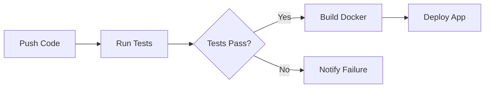

# 🚗 Car Price Classification

> **Assignment 3**: Multinomial Logistic Regression with MLflow & CI/CD  
> Transforming regression into intelligent 4-class classification

[](https://www.python.org/)
[](http://mlflow.ml.brain.cs.ait.ac.th/)
[](https://github.com/features/actions)
[]()

---

## 🎯 What This Project Does

This project converts car price prediction from a **regression problem** into a **4-class classification task**, implementing everything from scratch including metrics, regularization, and deployment infrastructure.

### 💡 Key Highlights

- ✨ **Custom Implementation**: Logistic regression built from ground up
- 📊 **Complete Metrics Suite**: Accuracy, precision, recall, F1 (all from scratch)
- 🔧 **Ridge Regularization**: L2 penalty for better generalization  
- 📈 **MLflow Tracking**: Remote experiment logging & model registry
- 🚀 **Production Ready**: Docker + CI/CD with automated testing
- 🎨 **Modern Web App**: Responsive Dash dashboard with comparisons

---

## 💰 Price Classification

| Class | Label | Price Range (INR) | Description |
|-------|-------|-------------------|-------------|
| 🟢 0 | Low | ₹0 - ₹25L | Entry-level vehicles |
| 🟡 1 | Medium | ₹25L - ₹50L | Mid-range cars |
| 🟠 2 | High | ₹50L - ₹1Cr | Luxury vehicles |
| 🔴 3 | Premium | Above ₹1Cr | Ultra-luxury cars |

---

## 📁 Project Structure

```
A3/
│
├── 📱 app/
│   └── app.py                    # Modern Dash web application
│
├── 🔄 .github/
│   └── workflows/
│       └── ci-cd.yml            # CI/CD automation
│
├── 🧠 LogisticRegression.py     # Custom model implementation
├── 📓 A3_CarPrediction.ipynb  # Main experiments
│
├── 🧪 test_model.py             # Unit tests
├── 📊 Cars.csv                  # Dataset
├── 🔧 requirements.txt          # Dependencies
├── 🐳 Dockerfile                # Container config
├── 💾 model_artifacts.pkl       # Trained model

```

---

## 🚀 Quick Start

### Prerequisites

```bash
Python 3.9+
Docker (optional)
Git
```

### Installation

```bash
# 1️⃣ Clone the repository
git clone <your-repo-url>
cd A3

# 2️⃣ Create virtual environment
python -m venv .venv
source .venv/bin/activate  # Windows: .venv\Scripts\activate

# 3️⃣ Install dependencies
pip install -r requirements.txt
```

### Running the Project

**Option A: Run Web App Directly**
```bash
cd app
python app.py
# Open browser to http://localhost:8050
```

**Option B: Use Docker**
```bash
docker build -t car-price-classifier .
docker run -p 8050:8050 car-price-classifier
```

**Option C: Train Model**
```bash
jupyter notebook A3_car_price_classification.ipynb
```

**Option D: Run Tests**
```bash
pytest test_model.py -v
```

---

## 📊 Model Performance

### Assignment Evolution

| Assignment | Type | Problem | Best Score | Key Innovation |
|------------|------|---------|------------|----------------|
| **A1** | Linear Regression | Regression | R² = 0.6040 | Basic pipeline |
| **A2** | Enhanced Regression | Regression | R² = 0.8472 | Polynomial + Lasso |
| **A3** | Logistic Classification | Classification | **Accuracy = 70.48%** | Custom metrics + MLflow |

### 🏆 Best Model Configuration

```python
Configuration:
├── Penalty: None
├── Initialization: Zeros
├── Learning Rate: 0.01
├── Accuracy: 70.48%
└── Convergence: Stable
```

### Key Insights

- ✅ Zero initialization > Xavier initialization
- ✅ Higher learning rates (0.01) improved convergence
- ✅ Ridge regularization showed minimal impact
- ✅ Feature engineering was crucial for performance

---

## 🔬 Technical Implementation

### Custom Logistic Regression Features

```python
class LogisticRegression:
    """
    Multinomial logistic regression with ridge regularization
    """
    ✓ One-vs-rest classification
    ✓ Ridge (L2) penalty
    ✓ Multiple initialization methods
    ✓ Custom metric calculations
```

### Metrics (All From Scratch)

| Metric | Formula | Purpose |
|--------|---------|---------|
| **Accuracy** | `correct / total` | Overall correctness |
| **Precision** | `TP / (TP + FP)` | Positive prediction accuracy |
| **Recall** | `TP / (TP + FN)` | True positive detection rate |
| **F1-Score** | `2 × (P × R) / (P + R)` | Balanced performance |
| **Macro Avg** | `mean(metrics)` | Unweighted class average |
| **Weighted Avg** | `Σ(weight × metric)` | Class-balanced average |

---

## 🌐 Web Application

### Features

#### 📊 **Model Comparison Tab**
- Visual performance comparison (A1, A2, A3)
- Interactive charts & metrics
- Evolution timeline

#### 🔮 **Price Prediction Tab**
- User-friendly input form
- Real-time class prediction
- Confidence visualization

#### 📈 **Data Analytics Tab**
- Price distribution charts
- Feature correlation heatmap
- Year-wise trends

### Design Highlights

- 📱 **Fully Responsive** - Works on all devices
- 🎨 **Modern UI** - Gradients, shadows, smooth transitions
- ⚡ **Fast & Interactive** - Real-time updates
- 👤 **Branded** - Student ID displayed prominently

---

## 🔄 CI/CD Pipeline

### Automated Workflow



### What Gets Tested

- ✅ Python environment setup
- ✅ Dependency installation
- ✅ Unit test execution
- ✅ Dash app validation
- ✅ Docker build process

### Trigger Events

- Push to `main` or `master` branch
- Pull requests
- Manual workflow dispatch

---

## 📈 MLflow Integration

### Connection Details

```yaml
Server: http://mlflow.ml.brain.cs.ait.ac.th/
Experiment: st125988-a3
Model Name: st125988-a3-model
Stage: Staging
```

### Tracked Information

- 📊 All performance metrics (accuracy, F1, precision, recall)
- 🔧 Hyperparameters (learning rate, lambda, initialization)
- 💾 Model artifacts & preprocessing pipelines
- 📸 Visualization plots
- ⏱️ Training time & iterations

---

## 🧪 Testing

### Test Coverage

```python
✓ test_model_accepts_expected_input()
  - Validates input format
  - Checks data types
  
✓ test_model_output_has_expected_shape()
  - Verifies prediction shape
  - Validates class labels
  - Ensures integer outputs
```

### Run Tests

```bash
# Verbose output
pytest test_model.py -v

# With coverage
pytest test_model.py --cov=LogisticRegression

# Stop on first failure
pytest test_model.py -x
```

---

## 🐳 Docker Deployment

### Container Specs

```dockerfile
Base Image: python:3.10-slim
Port: 8050
Environment: Production
Size: Optimized (~200MB)
```

### Build & Run

```bash
# Build
docker build -t car-classifier:latest .

# Run with port mapping
docker run -p 8050:8050 car-classifier:latest

# Run in background
docker run -d -p 8050:8050 --name car-app car-classifier:latest

# View logs
docker logs -f car-app
```

---

## 📚 Documentation

For detailed information:

- 📓 **Notebooks**: Step-by-step explanations in Jupyter notebooks
- 📊 **MLflow**: View experiments at the MLflow server
- 🧪 **Tests**: Run unit tests to understand functionality
- 💻 **Code**: Well-commented implementation files


---

## 📝 License

This project is part of academic coursework. All rights reserved for educational purposes.

---

## 🙋‍♂️ Support & Questions

Need help? Check these resources in order:

1. 📖 Read the Jupyter notebooks for detailed explanations
2. 🔍 Review MLflow experiments for performance insights
3. 🧪 Run unit tests to verify your setup
4. 💬 Contact course instructors for assignment-specific questions

---

<div align="center">

*Demonstrating end-to-end ML pipeline from data to deployment*

</div>